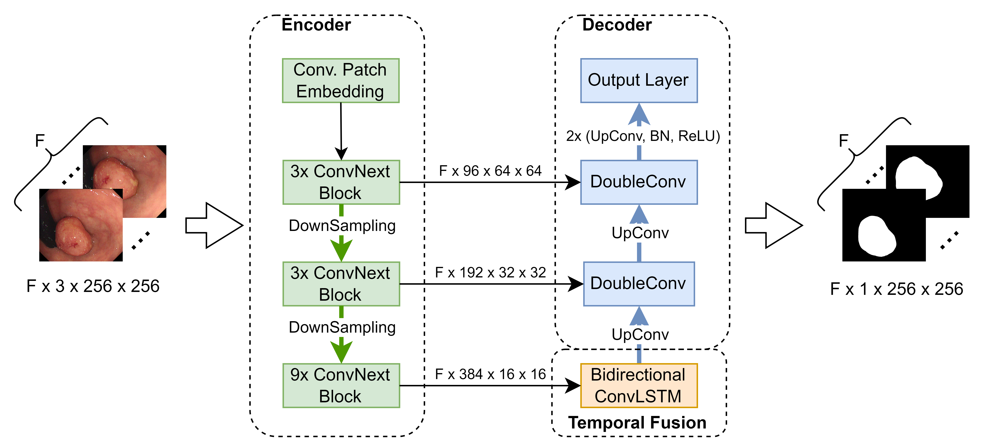
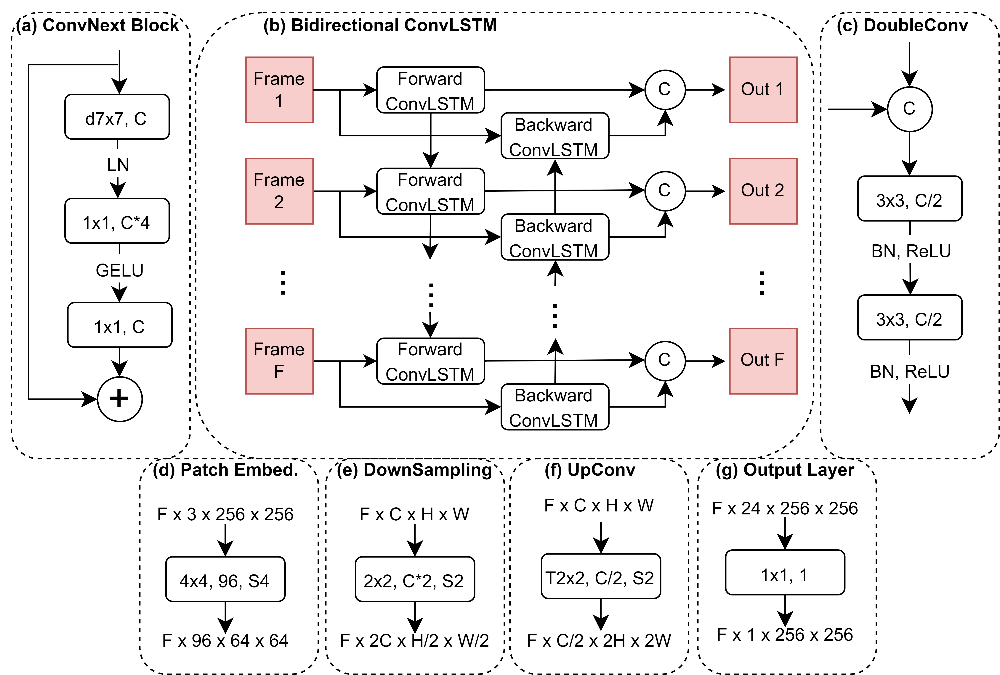

# PolypNextLSTM: A lightweight and fast polyp video segmentation network using ConvNext and ConvLSTM

Contact: Konrad Reuter, konrad.reuter@tuhh.de

Pretrained weights will follow soon.

This repository contains the source code for PolypNextLSTM. The main components of the model are an encoder based on ConvNext-tiny, a bidirectional convolutional LSTM for fusing information across multiple frames and a UNet-like decoder.





## Data Preparation

Clone the repository and create a data folder:
 ```
 git clone https://github.com/KonradReuter/PVS.git
 cd PVS
 mkdir data
 ```

Request and prepare the SUN-SEG dataset as explained [here](https://github.com/GewelsJI/VPS/blob/main/docs/DATA_PREPARATION.md) and move it to the created data folder.

For Windows users: The script to reorganize the file structure from the linked repository above will not work. Instead, use our slightly modified [script](./scripts/models/PNSPlus/utils/reorganize.py). After that you should manually remove the "SUN-Positive" folder and rename "SUN-SEG-Annotation" into "SUN-SEG".

## Create Virtual Environment and Install Dependencies

Python > 3.9 is recommended.

```
python3 -m venv venv
source venv/bin/activate || ./venv/Scripts/activate
python3 -m pip install pip setuptools wheel
python3 -m pip install -e .
```

## Training & Evaluating

The [main script](scripts/main.py) offers functions for training and evaluating a model. The general usage is as follows.
```
python scripts/main.py train --model-name=<model_name> --file-name=<file_name> --run-name=<run_name>
python scripts/main.py evaluate --model-name=<model_name> --file-name=<file_name> --run-name=<run_name>
```
Here the **model-name** defines which model is trained/evaluated. Our proposed model from above can be selected under the name "Conv_LSTM". Several other models used in our experiments can be used. A full list is given [here](scripts/README.md).

The **file-name** defines the name of the weight file the model is saved to / loaded from.

The **run-name** defines the name under which the run is logged in WandB.

To configure the hyperparameters, please edit the [args.json](config/args.json) file. A more detailed explanation of the different hyperparameters is given [here](config/README.md).

During our experiments we used shell scripts to chain multiple model trainings.
There are four scripts for training and evaluating models:

- **train_models.sh**: Trains and evaluates all constructed models using 5-fold cross validation.
- **train_num_frames.sh**: Trains and evaluates our PolypNextLSTM model with varying number of input frames using 5-fold cross validation.
- **train_single.sh**: Trains a model using a single direction ConvLSTM instead of a bidirectional one using 5-fold cross validation.
- **train_sota.sh**: Trains and evaluates 10 state-of-the-art models using 5-fold cross validation.

### HybridNet

The code for the [Hybird2D/3D model](https://link.springer.com/chapter/10.1007/978-3-030-59725-2_29) is not publicly available. We want to thank the authors for providing it to us. If you want to repeat our experiments, please send them a request as well.

The model will need some adjustments to run in our environment. For more information, contact us once you received the original model code.

### PNSNet/PNSPlusNet

The PNSNet and PNSPlusNet are based on the NS-Block module. To be able to use it, a CUDA extension has to be installed. [CUDA 11.7](https://developer.nvidia.com/cuda-11-7-0-download-archive) is required.

```
cd scripts/models/PNSPlus
python setup.py build develop
```

### SOTA backbone weights

CASCADE, COSNet and TransFuse use pretrained backbone weights, which are not downloaded automatically. Please download the weights from the following links and move them into the according model folder.

- [PVTv2-B2](https://drive.google.com/drive/folders/1Eu8v9vMRvt-dyCH0XSV2i77lAd62nPXV) (CASCADE)
- [DeepLabV3](https://drive.google.com/file/d/1hy0-BAEestT9H4a3Sv78xrHrzmZga9mj/view) (COSNet)
- [ResNet34](https://download.pytorch.org/models/resnet34-333f7ec4.pth) (TransFuse)
- [DeiT-small](https://dl.fbaipublicfiles.com/deit/deit_small_patch16_224-cd65a155.pth) (TransFuse)

## Code from other repositories

This repository includes code from various other repository. Many thanks to the authors for providing their code:

- [Pytorch-Unet](https://github.com/milesial/Pytorch-UNet)
- [PraNet](https://github.com/DengPingFan/PraNet)
- [SANet](https://github.com/weijun88/SANet)
- [TransFuse](https://github.com/Rayicer/TransFuse)
- [CASCADE](https://github.com/SLDGroup/CASCADE)
- [COSNet](https://github.com/carrierlxk/COSNet)
- [PNSNet](https://github.com/GewelsJI/PNS-Net)
- [PNSPlusNet](https://github.com/GewelsJI/VPS)
- [SSTAN](https://github.com/ShinkaiZ/SSTAN-VPS)
- [ConvLSTM_pytorch](https://github.com/ndrplz/ConvLSTM_pytorch/)
- [early-stopping-pytorch](https://github.com/Bjarten/early-stopping-pytorch)
