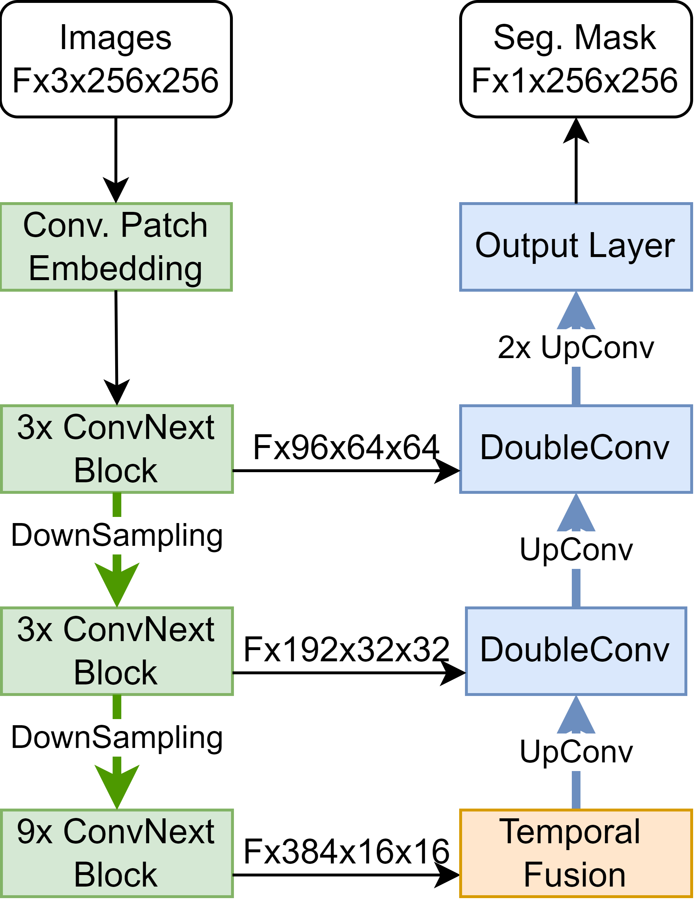
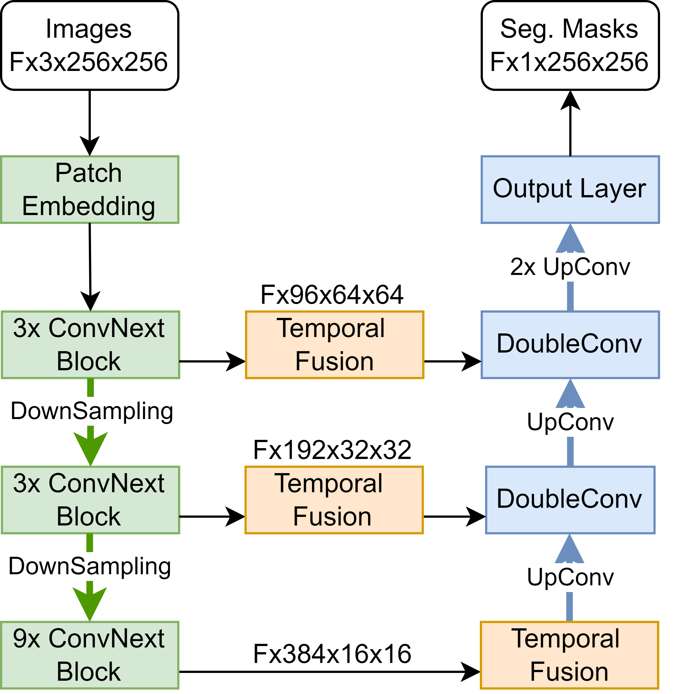
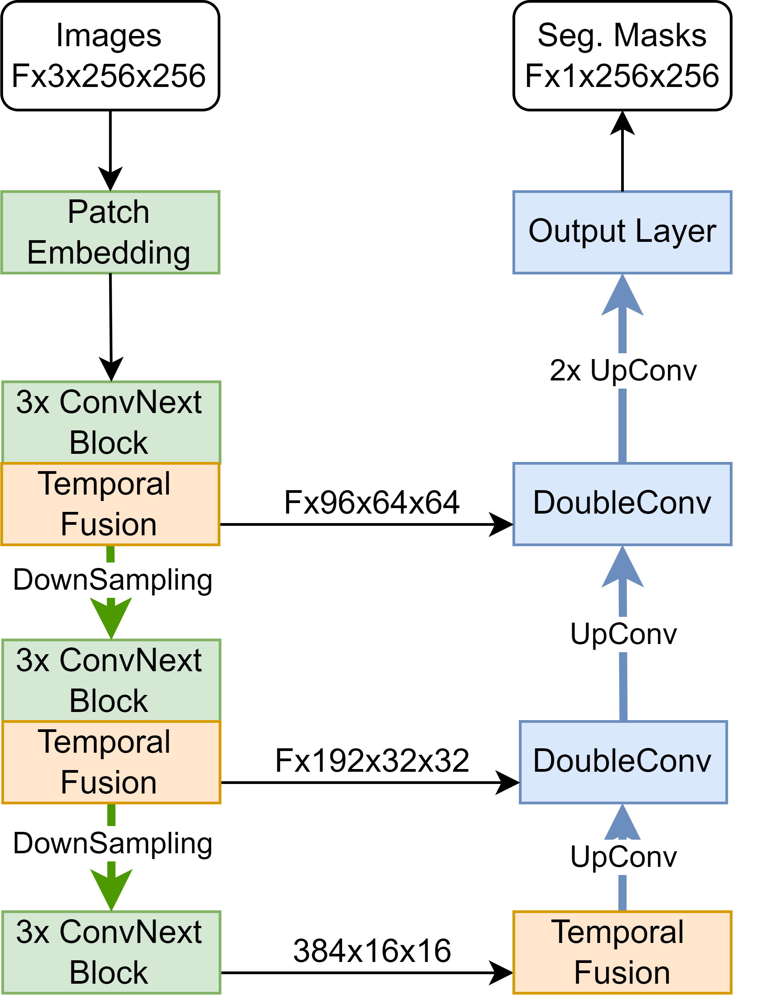

# main.py

## Pretraining
```
python scripts/main.py pretrain --model-name=<model_name> --file-name=<file_name> --run-name=<run_name>
```
Runs pretraining using inpainting. In the input images either random rectangles or a whole image is dropped and the goal is to reconstruct the dropped regions. Remember to set random_rect_dropout and/or img_dropout in [args.json](../config/args.json) to true.

The weight file will be saved as "<file_name>_pretrained.pt".

## Training
```
python scripts/main.py train --model-name=<model_name> --file-name=<file_name> --run-name=<run_name> [--pretrained]
```
Runs the training. If a pretrained weight file should be used, the pretrained flag should be set. The function will look for a file named "<file_name>_pretrained.pt".

## MultiThresholdEvaluation
```
python scripts/main.py multiThresholdEvaluation --model-name=<model_name> --file-name=<file_name> --test-set=<set_name>
```

Evaluates the model on a specific test set using multiple different thresholds and saves the results as csv. The idea is to find the threshold for which the model performs the best.

## Evaluate

```
python scripts/main.py train --model-name=<model_name> --file-name=<file_name> --run-name=<run_name>
```
Evaluates the model on the four different test sets from SUN-SEG.

# Arguments

## --model-name

Defines the model to be trained/evaluated. All possibilities will be listed in the following.

### Base models:

Models without temporal fusion but with different backbones.

- "Conv_base3": reduced ConvNext-tiny backbone
- "Conv_base": full ConvNext-tiny backbone
- "Swin_base3: reduced SwinV2-tiny backbone
- "Swin_base": full SwinV2-tiny backbone

### Model Configuration 1



Models using model configuration number 1 with different temporal fusion modules.

- "Conv_simple": Channel Stacking Module
- "Conv_3D": 3D Convolutions Module
- "Conv_LSTM": Bidirectional ConvLSTM Module **(=PolypNextLSTM**)
- "Conv_LSTM_single": Single Direction ConvLSTM Module
- "Conv_Attention": Temporal-Local Attention Module
- "Conv_NSA": NS-Block Module

### Model Configuration 2


Models using model configuration 2 with different temporal fusion modules.

- "Conv_simple_skip": Channel Stacking Module
- "Conv_3D_skip": 3D Convolutions Module
- "Conv_LSTM_skip": Bidirectional ConvLSTM Module
- "Conv_Attention_skip": Temporal-Local Attention Module
- "Conv_NSA_skip": NS-Block Module

### Model Configuration 3


Models using model configuration 3 with different temporal fusion modules.

- "Conv_simple_enc": Channel Stacking Module
- "Conv_3D_enc": 3D Convolutions Module
- "Conv_LSTM_enc": Bidirectional ConvLSTM Module
- "Conv_Attention_enc": Temporal-Local Attention Module
- "Conv_NSA_enc": NS-Block Module

### SOTA models

State-of-the-art models.

- "DeepLab": DeepLabV3
- "SANet": SANet
- "TransFuse": TransFuse-S
- "PraNet": PraNet
- "CASCADE": PVT_CASCADE
- "COSNet": COSNet
- "HybridNet": Hybrid2D/3D net
- "PNSNet": PNSNet
- "PNSPlusNet": PNSPlusNet
- "VACSNet": SSTAN

## --file-name

Name of the weight file that should be loaded/saved. Will be slightly modified by the different functions to avoid naming conflicts.

- The pretrain function save the weights as "<file_name>_pretrained.pt".

- The train function looks for a file named "<file_name>_pretrained.pt" if the pretrained flag is set. It saves the resulting weight file under "<file_name><validation_fold>.pt". The validation fold number is specified in the [args.json](../config/args.json) file.

- The multiThresholdEvaluation function does not add anything to the file name, it simply tries to load "<file_name> as the weight file.

- The evaluate function looks for a weight file as saved by the training function, so "<file_name><validation_fold>.pt".

## --run-name

Name of the run under which the training/evaluation process is logged in WandB. Can be ignored, if WandB is not used.

## --pretrained

If true, the train function tries to load pretrained model weights.

## --test-set

Specifies the test set used for multiThresholdEvaluation. Valid options are:

- "masked_vid_test_easy_seen"
- "masked_vid_test_easy_unseen"
- "masked_vid_test_hard_seen"
- "masked_vid_test_hard_unseen"